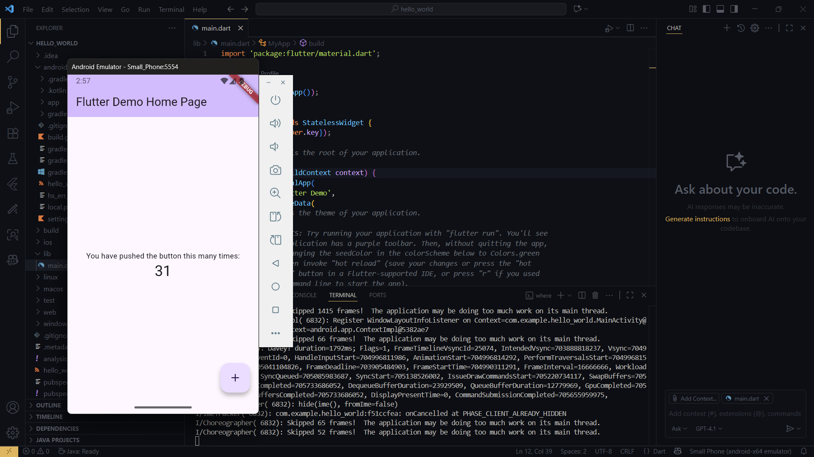
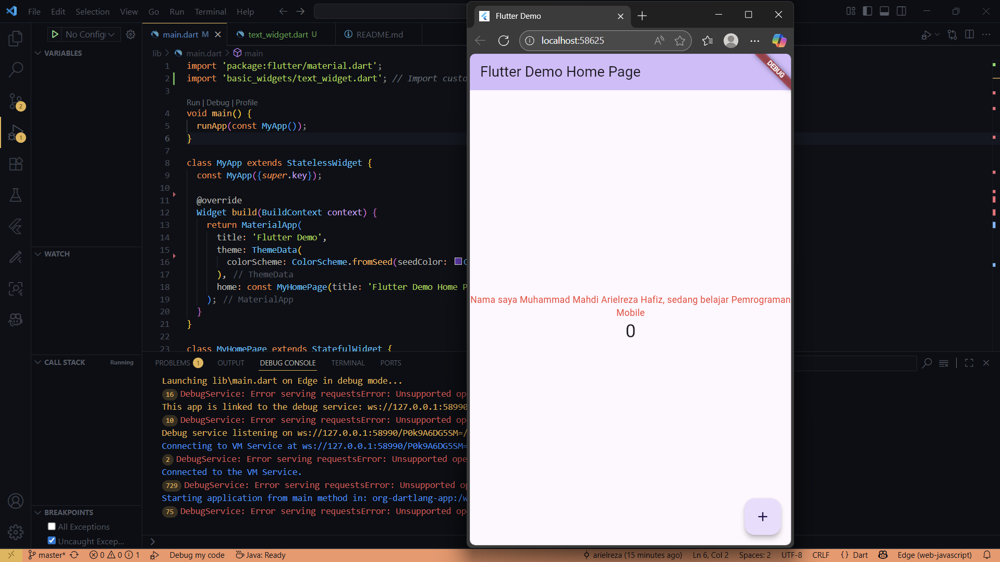
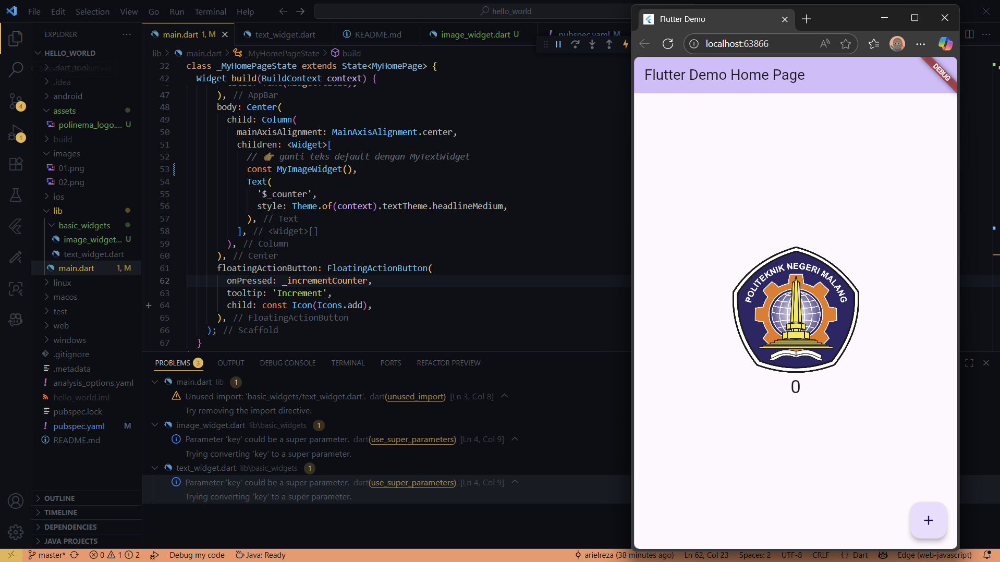
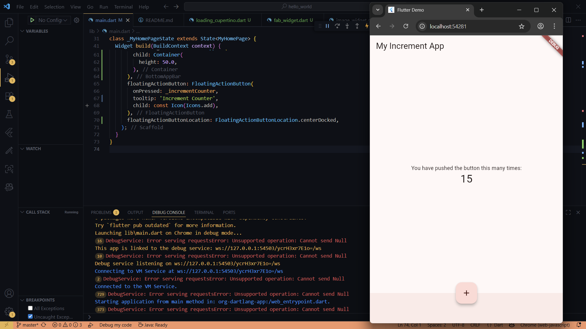
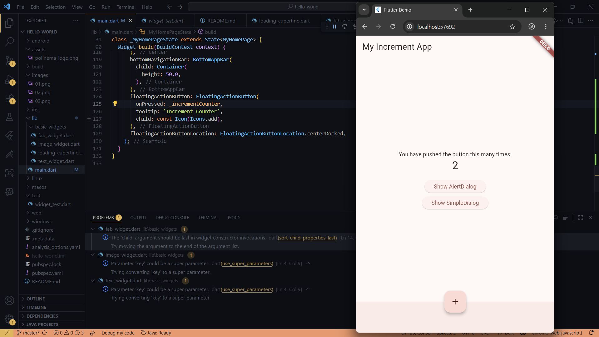
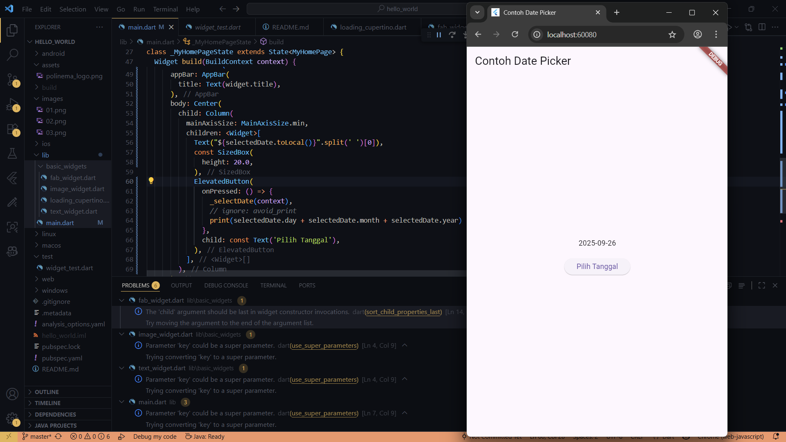

# hello_world

A new Flutter project.



---

## Praktikum 4: Menerapkan Widget Dasar

### Langkah 1: Text Widget
Saya membuat folder baru `basic_widgets` di dalam folder `lib`, lalu menambahkan file `text_widget.dart` dengan isi berikut:

```dart
import 'package:flutter/material.dart';

class MyTextWidget extends StatelessWidget {
  const MyTextWidget({Key? key}) : super(key: key);

  @override
  Widget build(BuildContext context) {
    return const Text(
      "Nama saya Muhammad Mahdi Arielreza Hafiz, sedang belajar Pemrograman Mobile",
      style: TextStyle(color: Colors.red, fontSize: 14),
      textAlign: TextAlign.center,
    );
  }
}
```
Perubahan pada main.dart

Saya mengimpor file text_widget.dart ke dalam main.dart:
```import 'basic_widgets/text_widget.dart';```

Kemudian pada bagian widget Column, teks bawaan diganti menjadi widget baru:
```children: <Widget>[
  const MyTextWidget(), // teks custom
  Text(
    '$_counter',
    style: Theme.of(context).textTheme.headlineMedium,
  ),
],
```

Hasil

Setelah dijalankan, aplikasi menampilkan teks
"Nama saya Muhammad Mahdi Arielreza Hafiz, sedang belajar Pemrograman Mobile" berwarna merah di atas counter.



Langkah 2: Image Widget

Saya menambahkan file baru image_widget.dart di dalam folder basic_widgets dengan isi: 
``` import 'package:flutter/material.dart';

class MyImageWidget extends StatelessWidget {
  const MyImageWidget({Key? key}) : super(key: key);

  @override
  Widget build(BuildContext context) {
    return const Image(
      image: AssetImage("assets/polinema_logo.png"),
    );
  }
}
```
Perubahan pada pubspec.yaml

Menambahkan konfigurasi asset agar Flutter bisa memuat gambar: 
``` flutter:
  assets:
    - assets/polinema_logo.png
  uses-material-design: true
```
Perubahan pada main.dart

Saya mengimpor file image_widget.dart ke dalam main.dart: 
```
 import 'package:hello_world/basic_widgets/image_widget.dart';
```

Kemudian pada bagian widget Column, saya menambahkan widget gambar di atas counter: 
``` children: <Widget>[
  const MyImageWidget(), // menampilkan logo Polinema
  Text(
    '$_counter',
    style: Theme.of(context).textTheme.headlineMedium,
  ),
],
```
Hasil

 Setelah dijalankan, aplikasi menampilkan logo Polinema di atas counter angka.
 

### Langkah 3: Scaffold Widget
Saya mengubah `main.dart` agar menggunakan `Scaffold` sesuai dengan Material Design. Scaffold ini menyediakan struktur dasar aplikasi seperti AppBar, Body, BottomAppBar, dan FloatingActionButton.

Perubahan pada main.dart:
```dart
class MyApp extends StatelessWidget {
  const MyApp({Key? key}) : super(key: key);

  @override
  Widget build(BuildContext context) {
    return MaterialApp(
      title: 'Flutter Demo',
      theme: ThemeData(
        primarySwatch: Colors.red,
      ),
      home: const MyHomePage(title: 'My Increment App'),
    );
  }
}

class MyHomePage extends StatefulWidget {
  const MyHomePage({Key? key, required this.title}) : super(key: key);
  final String title;

  @override
  State<MyHomePage> createState() => _MyHomePageState();
}

class _MyHomePageState extends State<MyHomePage> {
  int _counter = 0;

  void _incrementCounter() {
    setState(() {
      _counter++;
    });
  }

  @override
  Widget build(BuildContext context) {
    return Scaffold(
      appBar: AppBar(
        title: Text(widget.title),
      ),
      body: Center(
        child: Column(
          mainAxisAlignment: MainAxisAlignment.center,
          children: <Widget>[
            const Text("You have pushed the button this many times:"),
            Text(
              '$_counter',
              style: Theme.of(context).textTheme.headline4,
            ),
          ],
        ),
      ),
      bottomNavigationBar: BottomAppBar(
        child: Container(height: 50.0),
      ),
      floatingActionButton: FloatingActionButton(
        onPressed: _incrementCounter,
        tooltip: 'Increment Counter',
        child: const Icon(Icons.add),
      ),
      floatingActionButtonLocation: FloatingActionButtonLocation.centerDocked,
    );
  }
}
```
Hasil
Aplikasi sekarang memiliki AppBar di bagian atas, area body di tengah dengan teks dan counter, serta tombol Floating Action Button di bawah.
 

### Langkah 4: Dialog Widget

Saya mencoba menambahkan dialog sederhana menggunakan AlertDialog.

Perubahan pada main.dart:
``` class MyLayout extends StatelessWidget {
  const MyLayout({Key? key}) : super(key: key);

  @override
  Widget build(BuildContext context) {
    return Padding(
      padding: const EdgeInsets.all(8.0),
      child: ElevatedButton(
        child: const Text('Show alert'),
        onPressed: () {
          showAlertDialog(context);
        },
      ),
    );
  }
}

showAlertDialog(BuildContext context) {
  Widget okButton = TextButton(
    child: const Text("OK"),
    onPressed: () {
      Navigator.pop(context);
    },
  );

  AlertDialog alert = AlertDialog(
    title: const Text("My title"),
    content: const Text("This is my message."),
    actions: [okButton],
  );

  showDialog(
    context: context,
    builder: (BuildContext context) {
      return alert;
    },
  );
}
```
Hasil
 
Ketika tombol "Show alert" ditekan, muncul pop-up dialog dengan judul, pesan, dan tombol OK untuk menutupnya.

### Langkah 5: Input dan Selection Widget (TextField)

Saya menambahkan TextField untuk menerima input nama dari pengguna.

Perubahan pada main.dart:
``` class MyApp extends StatelessWidget {
  const MyApp({Key? key}) : super(key: key);

  @override
  Widget build(BuildContext context) {
    return MaterialApp(
      home: Scaffold(
        appBar: AppBar(title: const Text("Contoh TextField")),
        body: const Padding(
          padding: EdgeInsets.all(16.0),
          child: TextField(
            decoration: InputDecoration(
              border: OutlineInputBorder(),
              labelText: 'Nama',
            ),
          ),
        ),
      ),
    );
  }
}
```
Hasil
Aplikasi menampilkan sebuah field dengan border dan label "Nama" yang bisa diketik oleh pengguna.

### Langkah 6: Date and Time Picker

Saya menambahkan fitur Date Picker untuk memilih tanggal.

Perubahan pada main.dart:
```
class _MyHomePageState extends State<MyHomePage> {
  DateTime selectedDate = DateTime.now();

  Future<void> _selectDate(BuildContext context) async {
    final DateTime? picked = await showDatePicker(
      context: context,
      initialDate: selectedDate,
      firstDate: DateTime(2015, 8),
      lastDate: DateTime(2101),
    );
    if (picked != null && picked != selectedDate) {
      setState(() {
        selectedDate = picked;
      });
    }
  }

  @override
  Widget build(BuildContext context) {
    return Scaffold(
      appBar: AppBar(title: Text(widget.title)),
      body: Center(
        child: Column(
          mainAxisSize: MainAxisSize.min,
          children: <Widget>[
            Text("${selectedDate.toLocal()}".split(' ')[0]),
            const SizedBox(height: 20.0),
            ElevatedButton(
              onPressed: () => _selectDate(context),
              child: const Text('Pilih Tanggal'),
            ),
          ],
        ),
      ),
    );
  }
}
```
Hasil
 
Ketika tombol Pilih Tanggal ditekan, muncul dialog kalender. Setelah memilih tanggal, hasilnya langsung ditampilkan di layar.